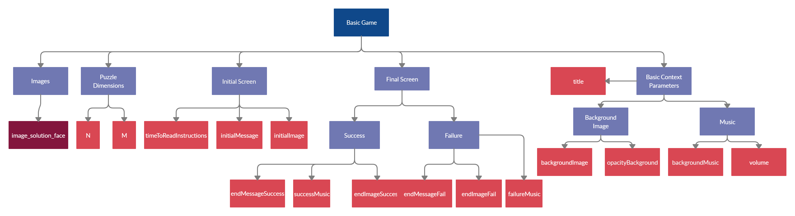

# Digital Puzzle 
Digital Puzzle is a digital resource for use in virtual escape rooms. It is a web application configurable by the author to solve different puzzles. 
It is also compatible with Escapp, an educational escape room management platform.

## Getting started 🚀

### Prerequisites 📋
In order to make local use of the resource you need to have:
- Internet connection
- [Node.js](https://nodejs.org/es/download/) and [Git](https://git-scm.com/downloads) installed on your computer.


### Installing 🔧

1. Open a new terminal and go to your working directory.
2. Clone the GitHub project and go to the puzzleER folder:
```shell
$ git clone https://github.com/rubalv96/PuzzleER
$ cd puzzleER
```
3. Execute the following command to install all the project dependencies in the 'node_modules' folder:
```sh
$ npm install
```
4. Execute the following command to start the development server:
```sh
$ npm run startc
```
	- The app will be available at the following URL http://localhost:8080.
	- SCORM 1.2 environment will be available at http://localhost:8080/scorm12.html.
	- SCORM 2004 environment will be available at http://localhost:8080/scorm2004.html.
5. Development server can be stopped by pressing 'Ctrl-C'.
6. Configuration can be specified in the following files (see [Configuration]() for further information):
    - app/config/config.js: Global configuration for the React application.
    - app/config/app_config.js: Main configuration for the React application.
    - app/config/crop_config.js: configuration for the crop images process.
    - app/config/config_lms.js: Configuration for the SCORM environments. 
7. Available commands are listed [here]().

## Configuration ⚙️

### Game configuration
| Config parameter | Description | Required | 
| ------ | ------ | ------ | 
| **title** | Title of your challenge | No | 
| **imageBackground** | Background image path | No
| **opacityBackground** | Image opacity | No
| **backgroundMusic** | Background music path | No
| **successMusic** | Music path to play when the user completes the puzzle | No
| **failureMusic** | Music path to play when the user fails| No
| **volume** | Global volume level (0 to 1) | No
| **M** | Number of columns of the puzzle | Yes
| **N** | Number of rows of the puzzle | Yes
| **fake_pieces** | Number of fake pieces in the board | No
| **reverseMode** | Mode that allows double-sided pieces | No
| **time** | Time to complete the challenge | No
| **zoomMode** | Mode that allows make zoom over the pieces | No
| **zoomFactor** | Zoom factor that magnifies the different pieces | No
| **timeToReadInstructions** | Time users have to read the starting instructions and story | No
| **initialMessage** | Story message of the challenge | No
| **initialMessagePrint** | Initial message in the print view | No
| **initialImage** | Path of the image that appears in the story tab | No
| **endMessageFail** | Message displayed when the users fail | No
| **endMessageSuccess** | Message displayed when the users complete the challenge | No
| **endImageSuccess** | Path of image displayed when the users complete the challenge | No
| **endImageFail** | Path of the image displayed when the users fail | No

### Crop configuration
| Config parameter | Description | Required | 
| ------ | ------ | ------ | 
| **image_solution_face** | Path of the face solution image (will be croped) | Yes | 
| **image_solution_reverse** | Path of the reverse solution image (will be croped) | Only in reverse mode
| **image_fake1_face** | Path of the false face image (will be croped) | Only if you want false pieces
| **image_fake1_reverse** | Path of the false reverse image | Only if you want false pieces and the reverse mode is active


### Escapp configuration
| Config parameter | Description | Required | 
| ------ | ------ | ------ | 
| **endpoint** | Escapp URL of the Escape Room | No | 
| **localStorageKey** | Key to save Escapp Data in the Local Storage | No
| **imagesPath** | Path of the images that will be cropped | No
| **appPuzzleIds** | Order id of the puzzle in the Virtual Escape Room | No
| **forceValidation** | Required authentication in Escapp in order to play (true or false) | No

### Use Guide



