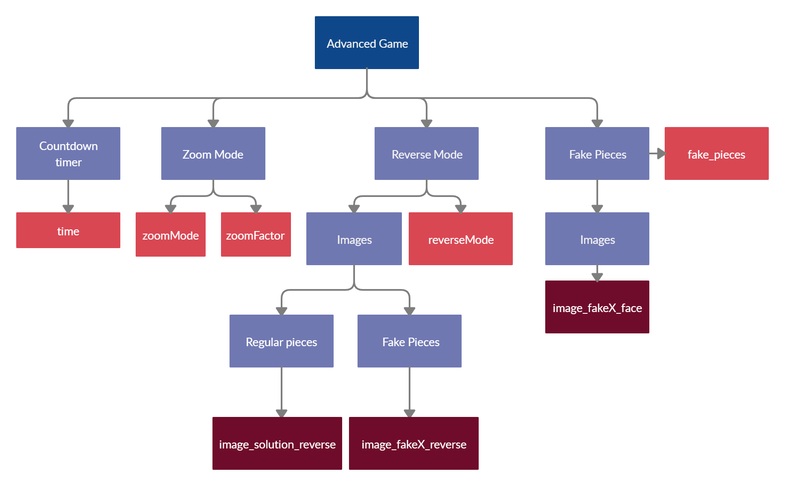

# Digital Puzzle 
Digital Puzzle is a digital resource for use in virtual escape rooms. It is a web application configurable by the author to solve different puzzles. 
It is also compatible with Escapp, an educational escape room management platform.
## Demo

## Getting started 🚀

### Prerequisites 📋
In order to make local use of the resource you need to have:
- Internet connection
- [Node.js](https://nodejs.org/es/download/) and [Git](https://git-scm.com/downloads) installed on your computer.


### Installing 🔧

 - Open a new terminal and go to your working directory.
 - Clone the GitHub project and go to the puzzleER folder:
```shell
$ git clone https://github.com/rubalv96/PuzzleER
$ cd puzzleER
```
 - Execute the following command to install all the project dependencies in the 'node_modules' folder:
```sh
$ npm install
```
 - Execute the following command to start the development server:
```sh
$ npm run startc
```

     - The app will be available at the following URL
          http://localhost:8080.
     - SCORM 1.2 environment will be available at http://localhost:8080/scorm12.html.
     - SCORM 2004 environment will be available at http://localhost:8080/scorm2004.html.
 - Development server can be stopped by pressing 'Ctrl-C'.
 - Configuration can be specified in the following files:
    - app/config/config.js: Global configuration for the React application.
    - app/config/app_config.js: Main configuration for the React application.
    - app/config/crop_config.js: configuration for the crop images process.
    - app/config/config_lms.js: Configuration for the SCORM environments. 


## Configuration ⚙️

### Game configuration
| Config parameter | Description | Required | 
| ------ | ------ | ------ | 
| **title** | Title of your challenge | No | 
| **imageBackground** | Background image path | No
| **opacityBackground** | Image opacity | No
| **backgroundMusic** | Background music path | No
| **successMusic** | Music path to play when the user completes the puzzle | No
| **failureMusic** | Music path to play when the user fails| No
| **volume** | Global volume level (0 to 1) | No
| **M** | Number of columns of the puzzle | Yes
| **N** | Number of rows of the puzzle | Yes
| **fake_pieces** | Number of fake pieces in the board | No
| **reverseMode** | Mode that allows double-sided pieces | No
| **time** | Time to complete the challenge | No
| **zoomMode** | Mode that allows make zoom over the pieces | No
| **zoomFactor** | Zoom factor that magnifies the different pieces | No
| **timeToReadInstructions** | Time users have to read the starting instructions and story | No
| **initialMessage** | Story message of the challenge | No
| **initialMessagePrint** | Initial message in the print view | No
| **initialImage** | Path of the image that appears in the story tab | No
| **endMessageFail** | Message displayed when the users fail | No
| **endMessageSuccess** | Message displayed when the users complete the challenge | No
| **endImageSuccess** | Path of image displayed when the users complete the challenge | No
| **endImageFail** | Path of the image displayed when the users fail | No

### Crop configuration
| Config parameter | Description | Required | 
| ------ | ------ | ------ | 
| **image_solution_face** | Path of the face solution image (will be croped) | Yes | 
| **image_solution_reverse** | Path of the reverse solution image (will be croped) | Only in reverse mode
| **image_fake1_face** | Path of the false face image (will be croped) | Only if you want false pieces
| **image_fake1_reverse** | Path of the false reverse image | Only if you want false pieces and the reverse mode is active


### Escapp configuration
| Config parameter | Description | Required | 
| ------ | ------ | ------ | 
| **endpoint** | Escapp URL of the Escape Room | No | 
| **localStorageKey** | Key to save Escapp Data in the Local Storage | No
| **imagesPath** | Path of the images that will be cropped | No
| **appPuzzleIds** | Order id of the puzzle in the Virtual Escape Room | No
| **forceValidation** | Required authentication in Escapp in order to play (true or false) | No

### Use Guide
This resource can be used to create very complex applications, for this reason, we can classify the game in two different modes: Basic Game and Advanced Game.

#### Basic Game
You only need to set three parameters to build your first basic puzzle. 
- **N** and **M**. Set the dimensions of the puzzle (number of rows and columns respectively).  If you want a puzzle with 3 rows and 2 columns, you have to set N=3 and M=2 in the configuration file.
- **image_solution_face**.  Sets the directory where the solution image is located from which the pieces for the puzzle will be extracted.

As an optional but highly recommended part you can define the context of the challenge through these configuration parameters:
- **title**. To set the title of the challenge.
-  **imageBackground**. This parameter indicates the image path that will be used as background in the application.
- **opacityBackground**. This parameter allows setting the opacity of the background image to allow a better display of the image content. It takes values from 0 to 1.
- **backgroundMusic**. In this parameter you must incorporate the path of the file where the audio is relative to the background music you want to listen to while solving the challenge.
- **volume**. Thanks to this parameter you can control the global volume of the application. It takes values from 0 to 1.

Besides, it is also important to define the messages that appear when the application is started and when the challenge is solved.
##### Initial Screen
- **initialMessage** and **initialMessagePrint**. These are the messages that appear when the application is started and can be the ones related to the challenge history. initialMessagePrint will be seen only in the print view.
- **initialImage**. This is the path of the image that accompanies the initial message.

##### Final Screen
- **endMessageSuccess**. This parameter will be the message that appears when the puzzle is successfully completed.
- **endMessageFail**. This parameter will determine the message that appears when the puzzle is wrong.
- **successMusic**. This parameter indicates the path of the audio that will be played when the challenge is successfully completed.
- **failureMusic**. This parameter indicates the path of audio that will be played when the puzzle solution is not correct.

#### Configuration scheme for the Basic Game


#### Advanced Game
The application allows you to add many more gaming features. 
##### Reverse Mode
It allows us to define pieces with double sides. For this we need to activate the option **reverseMode** in the configuration file (setting it to *true*). Besides, we also need to define which is the path where the image will be used for the back side of the pieces, this will be done through the parameter **image_solution_reverse**.

##### Fake Pieces Mode
The application also allows you to define fake pieces to make the game more difficult. To do this, several parameters must be defined:
- **fake_pieces**. In this parameter you will incorporate the number of fake pieces that you want to add to the solution pieces.
- **image_fake1_face**. In this parameter the path of the image of the fake pieces is specified. More dummies can be added, for this purpose additional parameters should be added with the format **image_fake*X*_face** where the image path is specified and where *X* represents a numerical value.
If, in addition, we want the fake pieces to have double sides then we have to define the parameter **image_fake*X*_reverse** where the path of the image is specified and where *X* is a numerical value. 

##### Zoom Mode
It is possible to add a Zoom mode to be able to enlarge the pieces we want. To do this, we must activate this mode with the parameter **zoomMode** (true), and also indicate the magnification factor through **zoomFactor**.

##### Countdown timer
The application allows you to define a maximum time to solve the challenge. To do this, you must define the **time** parameter, indicating in seconds the time to finish the puzzle.

#### Configuration scheme for the Advanced Game



### Available commands

|Command| Description |
|--|--|
|npm run startc  | Start the development server. |
|npm run production  | Create a production ready build of the application in the 'dist' folder. |
|npm run scorm_package  | Create a production ready build of the application and package it into two SCORM packages (compliant with SCORM 1.2 and SCORM 2004) in the 'dist_scorm' folder. |
|npm run clean| Remove the 'dist' and 'dist_scorm' folders. |
|npm run lint| Execute an eslint check. |
|npm test| Run all tests. |


